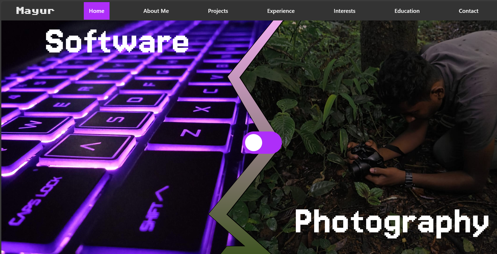

# 🚀 MyWebPage  

> **Still a Work in Progress...**  
A **Vite x React** project to enhance my React skills while building something meaningful.  

---

## 🎯 About the Project  

I’ve always wanted to create a **personal portfolio**, and this project is a step towards achieving that goal.  

This webpage is built entirely with **React**, allowing me to seamlessly integrate functionality and interactive elements.  

### 🔥 Features  

- 🖼 **Photography & Software Showcase** – A toggle button lets users switch between my two passions.  
- ⚡ **Fast & Optimized** – Leveraging Vite for lightning-fast builds and performance.  
- 🎨 **Modern UI** – Clean and minimalistic design for a smooth user experience.  
- 🌐 **Live Deployment** – Hosted on **Netlify** for easy access.  

---

## 🚀 Live Preview  

🔗 [MyWebPage](https://mayurksetty.netlify.app)  

---

## 🛠 Tech Stack  

- **Frontend**: React + Vite  
- **Styling**: CSS
- **Deployment**: Netlify  

---

## 📌 To-Do List  

- [ ] Improve UI/UX design  
- [ ] Add animations for smoother transitions  
- [ ] Enhance mobile responsiveness  
- [ ] Implement a contact form  

---

## 📷 Sneak Peek

Feel free to check out the **live demo** and let me know what you think! 🚀  
